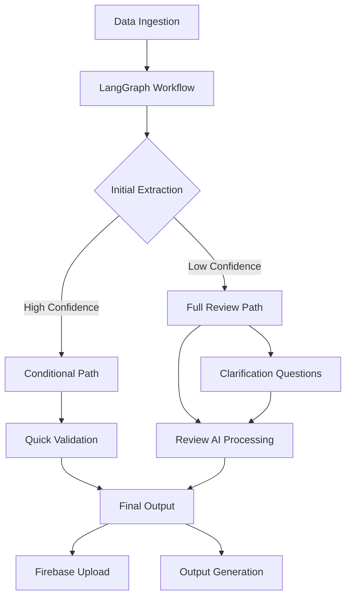

# Cluster AI - Meat Inventory Processing Pipeline

An intelligent data processing pipeline that extracts structured information from meat supplier inventory files using Large Language Models (LLMs) and advanced workflow orchestration. The pipeline ingests Excel/CSV files containing product descriptions and automatically extracts standardized meat attributes like species, primal cuts, grades, sizes, and brands using LangGraph workflows.

## 🎯 Key Features

- **🔄 LangGraph Workflow Engine**: Advanced workflow orchestration with conditional processing paths
- **🔥 Firebase Integration**: Real-time data storage and retrieval with Firestore
- **💾 Intelligent Caching**: Prevents duplicate API calls and improves performance
- **📊 Comprehensive Evaluation**: LangSmith-powered evaluation framework with ground truth datasets
- **🚀 Batch Processing**: Optimized for large-scale data processing with checkpointing
- **🔍 Quality Control**: Multi-stage review process with confidence scoring and flagging
- **📈 Real-time Monitoring**: Comprehensive logging and performance tracking
- **🎯 Multi-Provider Support**: OpenAI, Anthropic, and other LLM providers

## 📁 Project Architecture

```
Cluster_AI/
├── config/
│   └── firebase/              # Firebase configuration files
├── data/
│   ├── incoming/              # Raw supplier files (Excel/CSV)
│   └── processed/             # Processed data files
├── src/
│   ├── AIs/                   # AI Processing Components
│   │   ├── graph.py           # LangGraph workflow orchestration
│   │   ├── llm_extraction/    # LLM-based extraction modules
│   │   ├── Clarifications/    # Clarification processing system
│   │   └── review/            # Review and quality control AI
│   ├── data_ingestion/        # Data processing pipeline
│   │   ├── core/              # Core data processing modules
│   │   ├── processor.py       # Main data processing orchestrator
│   │   └── utils/             # Data processing utilities
│   ├── database/              # Firebase and database operations
│   │   ├── firebase_client.py # Firebase client interface
│   │   ├── excel_to_firestore.py # Excel to Firestore integration
│   │   └── run_scripts/       # Database operation scripts
│   ├── Caching/               # Intelligent caching system
│   │   ├── cache_orchestrator.py # Cache management orchestration
│   │   ├── cache_manager.py   # Core cache operations
│   │   └── cache_query.py     # Cache querying and validation
│   ├── Evals/                 # Evaluation framework
│   │   ├── eval_process.py    # LangSmith evaluation process
│   │   ├── model_caller/      # Model testing interface
│   │   └── data/              # Ground truth and test datasets
│   ├── output_generation/     # Output and reporting
│   │   ├── file_writer.py     # File output generation
│   │   └── report_generator.py # Summary report generation
│   └── run_pipeline.py        # Main pipeline orchestrator
├── outputs/                   # Generated output files
├── logs/                      # Pipeline execution logs
├── tests/                     # Unit and integration tests
├── run_fast_batch.py          # Optimized batch processing script
├── requirements.txt           # Python dependencies
├── firebase.json              # Firebase project configuration
└── README.md                  # This file
```

## 🚀 Quick Start

### Prerequisites

- Python 3.10 or higher
- OpenAI API key (or other LLM provider)
- Firebase project (optional, for data persistence)
- LangSmith API key (optional, for evaluation)

### Installation

1. **Clone and setup the project**:
```bash
git clone <repository-url>
cd Cluster_AI
pip install -r requirements.txt
```

2. **Configure environment variables**:
```bash
# Create .env file with your API keys
touch .env

# Add your configuration
cat >> .env << EOF
OPENAI_API_KEY=your_openai_api_key
LANGCHAIN_API_KEY=your_langsmith_api_key
LANGCHAIN_TRACING_V2=true
FIREBASE_PROJECT_ID=your_firebase_project_id
LOG_LEVEL=INFO
EOF
```

3. **Place your data files**:
```bash
# Move your supplier files to the incoming directory
cp /path/to/your/files/*.xlsx data/incoming/
```

### Basic Usage

#### Standard Pipeline Processing

Run the complete LangGraph pipeline for Beef Chuck category:

```bash
python src/run_pipeline.py --categories "Beef Chuck"
```

Run with test mode (first 10 records only):

```bash
python src/run_pipeline.py --categories "Beef Chuck" --test-run
```

Process multiple categories:

```bash
python src/run_pipeline.py --categories "Beef Chuck,Beef Loin,Beef Rib"
```

Upload results to Firebase:

```bash
python src/run_pipeline.py --categories "Beef Chuck" --upload-to-firebase
```

#### Optimized Batch Processing

For large-scale processing with checkpointing:

```bash
python run_fast_batch.py --test-run
python run_fast_batch.py --upload-firebase
```

## 🔄 Pipeline Architecture

### LangGraph Workflow System

The pipeline uses a sophisticated LangGraph workflow with conditional processing:



### Processing Stages

#### Stage 1: Data Ingestion (`DataProcessor`)
- **Input**: Excel/CSV files in `data/incoming/`
- **Process**:
  - Multi-format file reading with automatic detection
  - Column mapping and normalization
  - Data cleaning and validation
  - Duplicate detection and removal
- **Output**: Processed DataFrame ready for AI processing

#### Stage 2: LangGraph Workflow (`BeefProcessingWorkflow`)
- **Input**: Processed data from Stage 1
- **Process**:
  - Dynamic beef extraction with confidence scoring
  - Conditional processing based on extraction confidence
  - Clarification question generation for ambiguous cases
  - Review AI for quality control and validation
  - Multi-provider LLM support (OpenAI, Anthropic)
- **Output**: Structured extraction results with metadata

#### Stage 3: Output Generation (`FileWriter`)
- **Input**: Extraction results from Stage 2
- **Process**:
  - Quality validation and flagging
  - Excel and CSV output generation
  - Performance metrics and reporting
  - Firebase integration (optional)
- **Output**: 
  - `outputs/{category}_extracted.csv` - Clean records
  - `outputs/{category}_extracted_flagged.csv` - Records needing review
  - `outputs/master_beef_extraction_{timestamp}.xlsx` - Master Excel file
  - `outputs/clarification_questions_{timestamp}.xlsx` - Clarification questions

## 📊 Expected Data Format

Your incoming files should contain these columns (flexible naming supported):

| Required Field | Accepted Column Names |
|----------------|-----------------------|
| Product Code   | `product_code`, `item_code`, `code`, `sku` |
| Description    | `product_description`, `description`, `product_name`, `item_name` |
| Category       | `category_description`, `category`, `dept`, `department` |
| Brand (optional) | `brand_name`, `brand`, `manufacturer` |

### Example Input Data

```csv
Item Code,Product Description,Department,Brand Name
A123,Beef Chuck Shoulder Clod 15# Choice Certified Angus,Beef Chuck,Certified Angus Beef
B456,Prime Beef Chuck Flat Iron Steak 8oz,Beef Chuck,Premier Beef
C789,Wagyu Beef Chuck Roll 12lb,Beef Chuck,Snake River Farms
```

## 📋 Extracted Attributes

The LangGraph workflow extracts comprehensive meat attributes:

| Attribute | Description | Example Values |
|-----------|-------------|----------------|
| `species` | Type of meat | Beef, Pork, Lamb |
| `primal` | Primary cut section | Chuck, Loin, Rib, Round |
| `subprimal` | Specific cut within primal | Shoulder Clod, Flat Iron, Strip Loin |
| `grade` | USDA grade or quality level | Prime, Choice, Select, Wagyu |
| `size` | Numeric size value | 15, 8.5, 2.5 |
| `size_uom` | Unit of measurement | lb, oz, #, kg |
| `brand` | Brand or certification | Certified Angus, Creekstone Farms |
| `bone_in` | Whether product contains bone | true, false |
| `confidence` | Extraction confidence score | 0.0 to 1.0 |
| `needs_review` | Flagged for manual review | true, false |
| `miss_categorized` | Potentially miscategorized | true, false |

## 🔥 Firebase Integration

### Setup Firebase

1. **Initialize Firebase project**:
```bash
# Configure Firebase project
firebase login
firebase use your-project-id
```

2. **Deploy Firestore rules**:
```bash
firebase deploy --only firestore:rules
```

### Automatic Upload

Results are automatically uploaded to Firebase when using the `--upload-to-firebase` flag:

```bash
python src/run_pipeline.py --categories "Beef Chuck" --upload-to-firebase
```

### Manual Database Operations

```python
from src.database.excel_to_firestore import ExcelToFirestore

# Initialize uploader
uploader = ExcelToFirestore(base_collection_prefix="meat_inventory")

# Upload Excel file
collection_name, stats = uploader.import_excel("outputs/master_file.xlsx")
```

## 📊 Evaluation Framework

### LangSmith Integration

The project includes a comprehensive evaluation framework using LangSmith:

```bash
# Run evaluation on specific datasets
python src/Evals/eval_process.py

# Evaluate specific primal cuts
python -c "from src.Evals.eval_process import eval_process; eval_process('test_chuck')"
```

### Available Test Datasets

- **test_chuck** - Chuck primal cuts (9 examples)
- **test_loin** - Loin primal cuts (5 examples)  
- **test_rib** - Rib primal cuts (8 examples)
- **test_round** - Round primal cuts (6 examples)
- **test_flank** - Flank primal cuts (4 examples)
- **test_variety** - Variety cuts (5 examples)
- **test_ground** - Ground beef products (6 examples)
- **test_other** - Other beef products (4 examples)

## 💾 Caching System

### Intelligent Caching

The pipeline includes a sophisticated caching system to prevent duplicate API calls:

```python
from src.Caching.cache_orchestrator import refresh_cache

# Refresh cache from Firebase
result = refresh_cache(
    collection_name="meat_inventory_latest",
    cache_file_path="data/processed/.accepted_items_cache.json"
)
```

### Cache Benefits

- **Cost Reduction**: Prevents duplicate LLM API calls
- **Performance**: Faster processing for repeated descriptions
- **Consistency**: Ensures consistent results for identical inputs

## 🧪 Testing

### Unit Tests

```bash
# Run all tests
pytest tests/ -v

# Run with coverage
pytest tests/ --cov=src --cov-report=html

# Run specific test modules
pytest tests/data_ingestion/ -v
pytest tests/output_generation/ -v
```

### Integration Tests

```bash
# Test pipeline with sample data
python src/run_pipeline.py --categories "Beef Chuck" --test-run
```

## 📈 Monitoring and Logs

### Real-time Monitoring

All pipeline runs generate comprehensive logs:

- **Pipeline Logs**: `logs/pipeline.log`
- **Batch Processing**: `logs/fast_batch.log`
- **Firebase Operations**: `logs/upload_reviewed.log`

### Performance Metrics

Each run provides detailed statistics:

```
📊 PIPELINE RESULTS:
   Total products: 1,250
   Successfully processed: 1,180
   Fast path (skip review): 850
   Full review path: 330
   📝 Review bot flagged for review: 70
   🚨 Review bot flagged miss-categorized: 12
   📋 Clarification questions: 25
   📈 Average confidence: 0.847
```

## 🔧 Configuration

### Environment Variables

```bash
# Core LLM Configuration
OPENAI_API_KEY=your_openai_api_key
OPENAI_MODEL=gpt-4o-mini
MAX_REQUESTS_PER_MINUTE=100

# LangSmith Evaluation
LANGCHAIN_API_KEY=your_langsmith_key
LANGCHAIN_TRACING_V2=true

# Firebase Configuration
FIREBASE_PROJECT_ID=your_project_id
FIREBASE_CREDENTIALS_PATH=path/to/credentials.json

# Logging
LOG_LEVEL=INFO
```

### Workflow Configuration

The LangGraph workflow can be customized in `src/AIs/graph.py`:

- **Provider Selection**: OpenAI, Anthropic, or other LLM providers
- **Confidence Thresholds**: Adjust confidence scoring for quality control
- **Processing Paths**: Modify conditional workflow logic
- **Review Criteria**: Customize review AI behavior

## 🔍 Troubleshooting

### Common Issues

1. **Missing API Keys**:
   ```
   Error: OPENAI_API_KEY not found in environment variables
   ```
   Solution: Create `.env` file with your API keys

2. **Firebase Connection**:
   ```
   Error: Firebase project not configured
   ```
   Solution: Initialize Firebase project and update `firebase.json`

3. **LangSmith Evaluation**:
   ```
   Error: LangSmith API key not configured
   ```
   Solution: Set `LANGCHAIN_API_KEY` environment variable

4. **Memory Issues**:
   ```
   Error: Out of memory during batch processing
   ```
   Solution: Use `run_fast_batch.py` with checkpointing

### Debug Mode

Enable verbose logging:

```bash
python src/run_pipeline.py --categories "Beef Chuck" --test-run
```

## 🚀 Advanced Usage

### Custom Workflow Development

Extend the LangGraph workflow for new use cases:

```python
from src.AIs.graph import BeefProcessingWorkflow

# Create custom workflow
workflow = BeefProcessingWorkflow(provider='anthropic')

# Process custom data
results = workflow.process_batch(custom_products)
```

### Batch Processing Optimization

For large datasets, use the optimized batch processor:

```python
from run_fast_batch import FastBatchProcessor

processor = FastBatchProcessor()
results = processor.run_fast_batch(test_run=False, upload_firebase=True)
```

## 🔮 Future Enhancements

- [ ] **Multi-Species Support**: Extend beyond beef to pork, lamb, and poultry
- [ ] **Real-time Processing**: WebSocket-based real-time data processing
- [ ] **Advanced ML Models**: Integration with custom-trained models
- [ ] **Web Interface**: React-based management dashboard
- [ ] **API Endpoints**: RESTful API for external integrations
- [ ] **Advanced Analytics**: Predictive analytics and trend analysis

## 📄 License

This project is licensed under the MIT License - see the LICENSE file for details.

## 🤝 Contributing

1. Fork the repository
2. Create a feature branch (`git checkout -b feature/new-enhancement`)
3. Make your changes with tests
4. Ensure all tests pass (`pytest`)
5. Submit a pull request

## 📞 Support

For questions, issues, or feature requests:
- Open an issue on GitHub
- Check the troubleshooting section
- Review the evaluation framework documentation

---

**Built with ❤️ for intelligent meat inventory processing** 